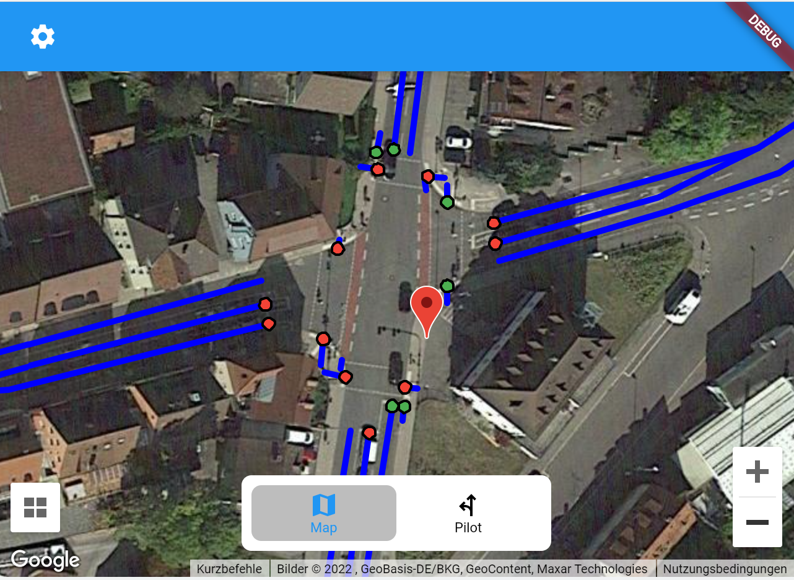

# V2X-Pilot

A client application for the [V2X-Server]().

- Check out smart intersection data from a birds eye perspective.
- Use the intersection pilot feature to navigate through the intersection

This project is written in Dart using the Flutter SDK. Thereby the app can be run on iOS, Android, Windows, macOS, Linux and the web.
In this early stage of developement the focus is on the Android and web version.

## Getting Started

To start developing the app please follow the [official guide](https://docs.flutter.dev/get-started/install) to install Flutter on your machine. After confirming the installation with `flutter doctor` you can run the app with `flutter run` from the project folder.

### References

Some icons used in this app are resources from Flaticon.com!
